# Project2 - The Quest for Bad Smells

## Data Collection
Data collection is one of the important aspects of this project that helped us find bad smells and inconsistencies in the projects we chose. Apart from using the [gitable.py] (https://github.com/TeamAGGS/Project2/tree/master/code/gitable.py/) to extract the events, we have also implemented other scripts that can be found under [Code] (https://github.com/TeamAGGS/Project2/tree/master/code/) to scrape through the [Github API's] (https://developer.github.com/v3/). We were able to retrieve some additional interesting details from the project1 repositories: 
- Events
- Issues
- Milestones
- Pull Requests

## Anonymization
We used a few anonymization tricks to ensure the privacy of the projects we were working with.
- While collecting the data for events, issues, milestones and pull-requests, the usernames and/or assignee names were anonymized to user1, user2,.. depending on the number of unique usernames that were found while collecting the data. The code snippet can be found below:

- The team names were then randomly changed to Team1, Team2 and Team3 to avoid any correspondence to the actual team names and  to ensure anonymity.
- We also removed any unecessary columns from the data sets that might have any reference to the original users. Example: In one of the project datasets, the title of the pull-requests referenced the Team members names.

## Tables
Each of the projects we worked on, have datasets/tables corresponding to the following:
##### Events
For a particular repository, the dataset for events has details including the issue number the event was associated with, timestamp when the event was created, action of the event, and the label,users,milestone corresponnding to the event.

##### Issues
The list of issues collected from the project repositories has columns for the issue number(unique),	username(creator),	labels used,	state of the issue currently(closed | open),	assignee name,	milestone tags,	created-at timestamp,	closed-at timestamp	and time spent on the issue.

##### Milestones
Milestone tag details were also collected in the form of tables. The file has columns : milestone number,	title, number of open issues, number of closed issues,	current state (closed | open), created-at timestamp, due-on timestamp, closed-at time. 

##### Pull-requests
Similarly, the tables representing the data for pull-requests included details : id, pull-request number,	current state,	created-at time, closed-at time, closed time-created time (days),	merged-at time and the username associated with it.

The sample data from one of the projects in the form of the above described tables can be found under [Data/Team1] (https://github.com/TeamAGGS/Project2/tree/master/data/Team1)

## Data
- [Repository1] (https://github.com/TeamAGGS/Project2/tree/master/data/Team1)
- [Repository2] (https://github.com/TeamAGGS/Project2/tree/master/data/Team2)
- [Repository3] (https://github.com/TeamAGGS/Project2/tree/master/data/Team3)

## Data Samples
Following are the screenshots from some of our data files used for this report.
- **Events:** 

- **Issues:** 

- **Milestones:** 

- **Pull requests:** 

## Feature Detection

### Events
- Number of events each user created
   - Events like creating issues, labels, etc and user who created it
- Labels used by each user
- Percentage of each label used
- Number of events for each user per milestone 
  - Contribution of each user for the milestone

### Issues
- Resolution Time in hours
   - Time gap between creation and closing of issues
- Issue start time in Date format
   - The time-date each issue was created/started working on
- Issue closing time in Date format
   - The time-date each issue was closed
- Frequency of the usage of each issue labels

### Milestones
We were able to generate few interesting feature detectors from the milestone data:
- Number of times milestone was used:
 Since at least a few issues are tagged with milestones, this measure shows how many issues were assigned to be completed for a milestone.
- Time difference between closed and created times: Amount of time spent on a particular milestone
- Time difference between closed time and due time: This feature detector would check if the milestone tags were closed before the due date.
- If a milestone has unusually smaller number of issues: This feature shows if any milestone tag has very few issues assigned to it. 
- If a milestone has unusually larger number of issues: This feature shows if any milestone tag has very high number of issues associated with. 

These detectors are added to the raw data as columns and the script that does this can be found [here] (https://github.com/TeamAGGS/Project2/blob/master/code/milestone_feature_extractors.py)

### Pull-requests
Following feature detecters related to the Pull Requests were found:
- Number of pull requests throughout the lifecycle of the project
- Number of pull requests per user?
  - The number of pull requests issued by each team member over the period of the entire project was accounted for
- Person who created the pull requests and the one who merged them
  - Each of the pull requests was analysed for the team member who created it and the one who completed the merge
- Unusually small time gap between the Pull request creation and merge
  - The Time gap between the creation and merge of each pull request being extremely low

## Feature Detection Results
Following features related to each of the categories were found:

### Events
- Number of events each user created
- Labels used by each user
- Percentage of each label
- Number of events for each user per milestone

### Issues
Using VB scripting,
- Resolution Time in hours
- Issue start time in Date format
- Issue closing time in Date format
- Frequency of the usage of each issue labels

### Milestones
The results for the feature detectors related to milestones explained in the above section, can be found [here] (https://github.com/TeamAGGS/Project2/tree/master/Data-with-Features).

Also, few points to note:
- The number of issues assigned to a milestone varies a lot wrt to the others & shows inefficiency in the initial planning stages of the project.
- Most of the milestone tags in every project were closed after the due date had passed.
- The milestones were not equally spaced through out the project and time spent on few of these was much larger than the others.
- Every project had a few milestone tags with very few or very large number of issues associated with them.

### Pull-requests
Using the feature detecters some very interesting facts about the repositories under consideration were found.
- There were hardly any pull requests for some of the repositories throughout the project.
- For one of the repositories, the number of pull requests was alarming.
- Pull requests were merged by the same person who created them.
- The time difference between creation of a pull requests and closing the request was extremely small for most of the pull requests.

## Bad smell detector

We imported these spreadsheets containing original data and features in Tableau for our further analysis. Tableau produces a family of interactive data visualization products focused on extracting and representing some patterns in the data. A fancy state of the art visualization can be created in a matter of seconds with simple drag-and-drop.

A very nice YouTube video give a short demo on how to create dashboards for Twitter data.

https://www.youtube.com/watch?v=uWIhdlnkEOM

We used similar methods to analyze our data and created dashboards for the same. 
Tableau files can be cound at https://github.com/TeamAGGS/Project2/tree/master/code:
- Issues: (ProjectReview.twb) 
- Pull Requests: (Pull_requests.twb) 
- Milestones: (milestone.twb)
  - By combining the feature detectors, we were also able to come up with few possible bad smells with respect to the milestones data using the [badsmell detector] (https://github.com/TeamAGGS/Project2/blob/master/code/milestone_badsmell_detector.py) as well.

## Bad smell results
### Events

#### Unequal distribution of issues created per user
----
##### Team1
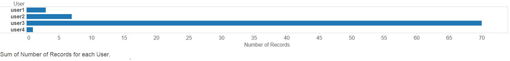
- It shows user3 created the most issues. 

##### Team2
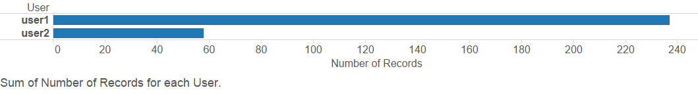
- User1 created about 4/5 of the events.

##### Team3
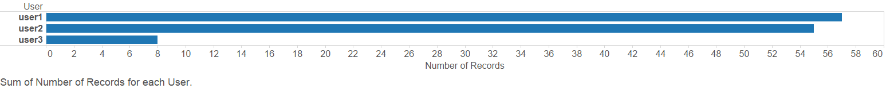
- User1 and user2 created almost all the issues.

#### 'Leader' driving the project
----
##### Team1
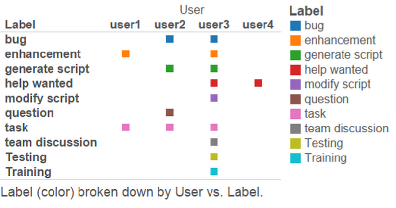
- User3 almost used all kinds of labels for the issues created. We can conclude that user3 is the team leader who creates tasks and assigns them to others.

##### Team2
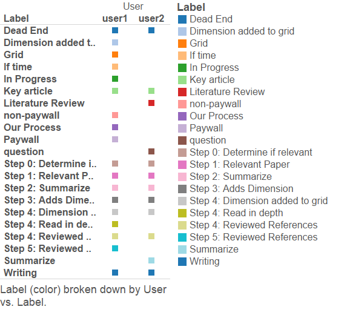
- From the figure above, we can see that user1 used almost all the labels, user2 used about half of the labels while they created the events.

##### Team3
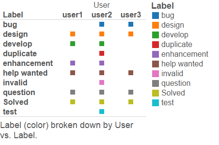
- It seems that they all used the labels quite evenly, which is a good sign. 

#### Inefficient use of labels created
----
##### Team1
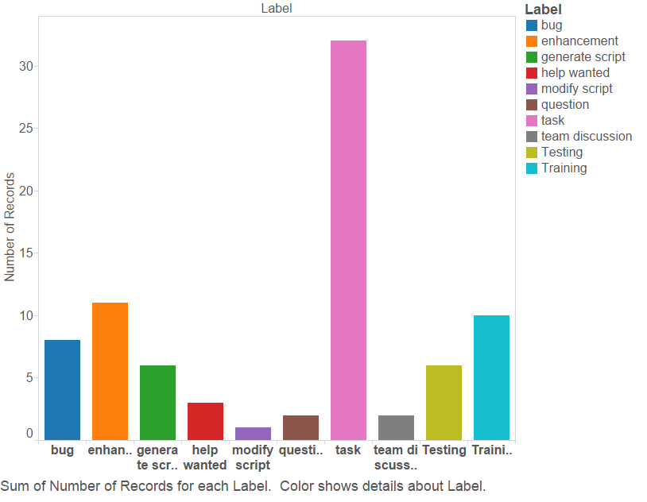
- As we can see from the figure, we can classify all these labels into 3 classes: plan, code and test. So, task, team discussion and question could be classified into plan phrase, bug, enhancement, generate script, modify script and help wanted could be classified into code phrase, while training and testing could be classified into test phrase. About one third of labels are plan, which follows the rule that 1/3 of time should be spent on plan. However, the number of labels for testing is way less than 1/2 .

##### Team2
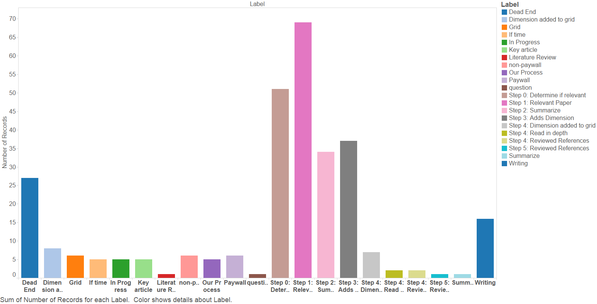
- From the figure above, we can tell they spent lots of time on the first 3 steps, which are the preparing for the project.

##### Team3
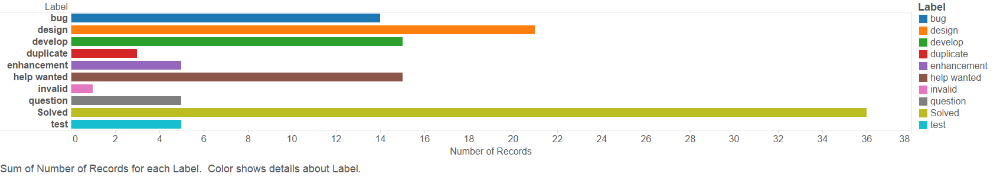
- If we classify all the labels into 3 kinds, plan, code and test, we can generally put design into plan phrase, test into test phrase, and anything else into code phrase. In that way, it doesn’t follow the rule that 1/3 of time should be spent on plan, 1/6 of time should be spent on code, and 1/2  of time should be spent on test. In fact, they spent way more time on code than anything else. That is not a good sign.

#### Number of events for each user per milestone indicating maximum contribution by a single user
----
##### Team1
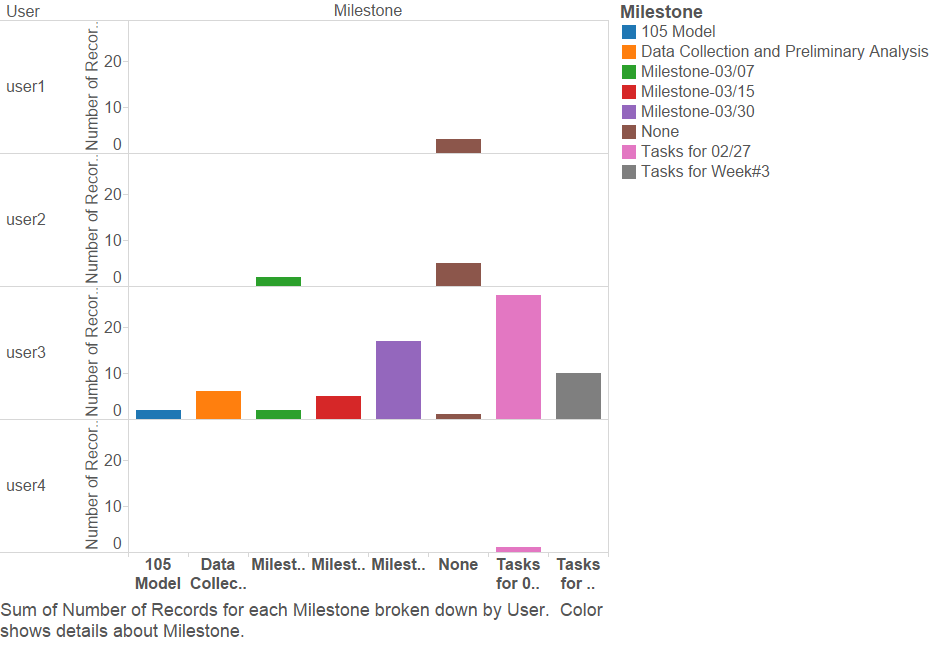
- User3 contributed a lot to these milestones, while others didn’t do lot.

##### Team2
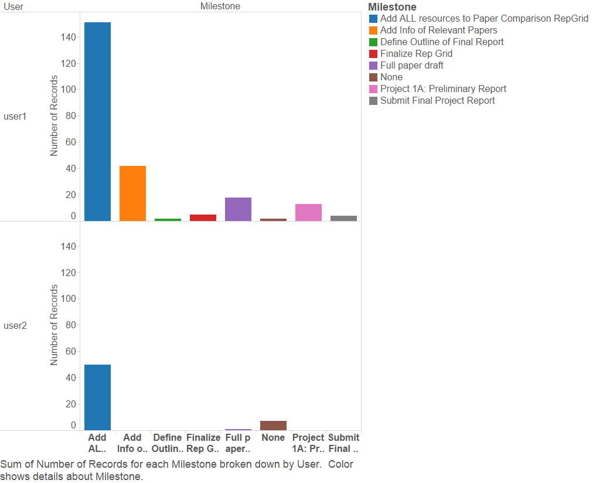
- From the figure above, we see that as for the milestone, user1 did way more work compared to user2, which is not a good sign.

##### Team3
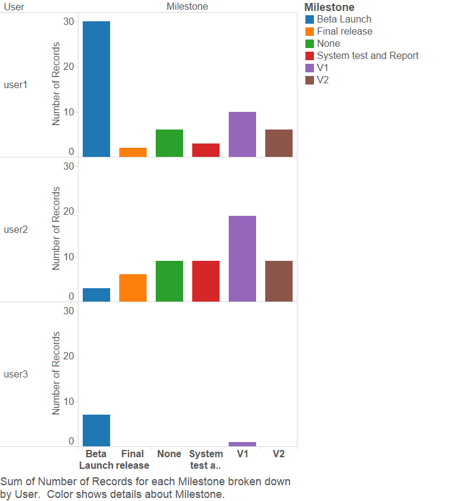
- User1 and user2 participated for these milestones evenly, while user3 seems haven’t contributed a lot to these milestones.

### Issues
We further categorize bad smells related to issues into three high-level questions.
#### What was the contribution of each user from project inception to completion?
----
##### Team1

- From the first figure it’s interesting to see approx. 48% issues were unassigned. Who was accountable for these issues? *Were these issues created just for the sake of it?*
- The second figure shows the effort (number of issues they worked on) put in by each user (per week) as the semester went along. It can be seen that most of the work was done between the weeks 8-11 of the year 2015. Even during this period of high activity, user4 chose to be a silent member of the team. It would seem user4 worked on their 7 issues during the weeks 7-9, and then resigned from the organization.
- It can also be seen that the organization scrambled at the end to finish the project as they didn’t care about assigning issues to anyone.
- One more observation is shown in the top part of the figure in the figure below. In an academic project like this, it is expected from team members to take the role of mentorship (scrum master) at least once. However, from the figure below it seems that 

##### Team2

- Given the high number of issues created in this repository, it’s safe to say that both the users worked on almost the same number of issues (first part of the figure above). Few issues were left unassigned which can be mapped to the phase when the team started documenting their results.
- From the second part of the figure it can be seen that although user2 contributed more hours/week to the project, user1 also had significant contribution. However, there is a period of two weeks (week 8-10) where we don’t see any contributions by user1.

##### Team3

- To scrutinize this repository is a challenge in itself since it provides too less useful data. *It’s difficult to understand how much effort was put in by each member of the organization since almost all the issues are unassigned.*
- In the figure above, the effort level shows a spike around the time of mid-report submission and dormants to almost zero around week-12 and regains strength around the time of final submission. *We still don’t know who was sitting idle at this point while someone else was slogging all the way through.*
- There is a smattering of contributions made by user2 around submission deadlines.

#### How much process was followed throughout the project?
----
##### Team1

- From the second part of the figure above, it can be seen that the members scrambled to finish work whenever a deadline approached. Issues were assigned and closed within an hour.
- Moreover, it would seem as if the members were keen on following the process of creating milestones, putting issues to a milestone and assigning issues to other members during the start of the project, but stopped doing this around the time of submissions, and scrambled to finish the work without giving attention to process. Here we see more than 50% of issues not being part of any milestone, and almost all of those issues were closed within less than an hour. *Were they just utility issues?*

##### Team2

- From the top part of the figure below, it can be seen that the user2 took the role of “Team Lead” who was responsible for creating and assigning issues.
- From the figure above it can also be observed that the team had planned milestones and had added issues to milestones. The team also spent most of the time in the first milestone “Add ALL resources to Paper Comparison RepGrid”. It will be interesting to see approx. how many weeks were spent in achieving this milestone.
- The effort put in issues within a milestone are almost equal which is sign of good planning and execution. Also the effort put in core issues are more than the effort put in utility issues like report writing and documentation which is another good sign of effort distribution.
- There are very few issues that weren’t part of any milestone.

##### Team3

- The first part of the figure above shows how many issues were created by users throughout the timeline of the project. It is clear from the figure above that user1 was the “Team Lead” of this organization. *The other two members have scattered contributions as far as taking charge of things is concerned.*
- The second part of the figure above partitions issues in their milestones and shows how much effort in hours was put in those issues. *Milestone V1 is quite interesting because it contains issues from the earlier phases of the project to the issues that were created during and after the Beta Launch.* 
- The milestone where all the testing was done (System test …) has very few issues assigned and very less effort was put in those issues. *Therefore, not a lot of effort was put into testing which goes against the benchmark laid out by Brooks.*

#### How frequently were each issue labels used?
----
##### Team1

- It can be seen from the figure above that the frequency of usage of issue labels is skewed.
- The issue label “task” seems a filler label which could have been assigned any other issue label such as generate script or training or bug.
- The presence of issue label “team discussion” doesn’t make much sense in a repository. Did the team discuss through comments in the issues marked as team discussion? Or is there a link to their Skype or Hangout meetings in those issues?
- However, it’s good to find that the issue labels “bug”, “enhancement”, “generate script”, “Training” and “Testing” were used almost equally. It shows that the team followed a process similar to generate script → bug → enhancement → Training → Testing.

##### Team2

- Most of issues have either label “Dead end”, “Writing” or “Step-4: Dimension added” assigned to them. This gives an indication that this is the repository of the Management track group where most of the issues involved documentation. 
- The high frequency of the label “Dead end” indicates that the team struggled to find relevant papers, and often they found themselves reading papers that weren’t of much use to them.
- Very less frequency of other issue labels is a concern. However, going by the name of those issue labels, it seems the team had a good process cycle (Our process → Step 0 → Step 1 → Step 2 → Step 3 → Step 4 → Writing), and they also kept a few things on hold (label = If time) for future.
- Overall, the team did a good job as far as mechanics of issues and effort is concerned.

##### Team3

- The figure above shows the frequency of usage of each issue labels. If we assume that the issue labels “design”, “develop” and “enhancement” relate to planning and coding phase of software development, and issue label “bug” and “test” relate to the testing phase, we see *approximately 70% of the occurrence of issue labels relate to the planning and coding phase, and only 10% belong to the testing phase.*
- However, we do see a software development life-cycle of Design → Develop  → Test  → Solved in this repository.
- The issue label “Solved” seems redundant since the closing of the issue itself indicates that the feature has been tested and is solved.

### Milestones

##### Team1
**How many issues were created under each milestone ?**
----

- The figure above shows the number of issues that were associated with a particular milestone. From this figure, we can see that the initial planning wasn't done in an effective way. A more beneficial way of working in software development would be to plan the milestones well in advance and to equally space out the tasks and responsibilities through out the duration of the project.
- Further, it shows that the members were trying to finish more work towards the last milestone and hence the sudden rise of number of issues.

**Time spent on the milestones**
----

- From the figure, it can be seen that the time spent on a few milestones was far greater than the others. This shows that the milestones were not evenly spaced out.
- Moreover, the most time taken was in milestone 2 and from the issues figure it can be seen that this milestone actually did not even have a huge number of issues.

**Which milestones had very few or very large number of issues?**
----

- We also were able to detect if any of the milestones had very few issues or very high number of issues associated with it.
- For this team, it can be seen from the above diagram that milestones 4 and 6 had very low number of issues whereas the milestone numbers 3 and 7 had high numbe of issues. This again account to tasks not being divided well.

Also, with the help of the [badsmells generator] (https://github.com/TeamAGGS/Project2/blob/master/code/milestone_badsmell_detector.py), we were able to detect a few other bad smells:
- For the team1's project, more than half of the milestones were closed past due date, Milestone numbers - 6, 5, 3, 2
- Also, with reference to median time spent on a milestone, we detected if milestones had very small number of issues but did spend more than median time on it, milestone number 6.
- This shows that even though limited number of tasks were assigned, the initial stages took much longer than anticipated since the closed date is beyond the due date as well.
- Another interesting find was that milestone number 7 had infact largest number of issues but took a relatively short time to be closed. This could mean that the work was divided into much smaller tasks which could have been trivial.

##### Team2
**How many issues were created under each milestone ?**
----

- The figure above shows the number of issues that were associated with a particular milestone. This figure like the team1's figure has the same story of milestones not being spaced out well. 
- Infact, it can be seen that most of the work was done in the middle of the project (milestone 5). This shows that the project members took a lot of the load at one time which would not necessarily be a good idea.

**Time spent on the milestones**
----

- From the figure above, its clear that the time spent on a few milestones was greater than the others. 
- This shows that the milestones were not evenly spaced out throughout the project.

**Which milestones had very few or very large number of issues?**
----

- We could also detect if any of the milestones had very few issues or very high number of issues associated with them.
- For the team2 project, it can be seen from the above diagram that milestone 7 had very low number of issues whereas the milestone numbers 5 and 8 have high number of issues compared to others.

Other points to note are:
- The milestones 8, 9, 3, 6, 7 were closed after the due date was passed. This accounts for bad smells in the project as time constraints and deadlines were not met.
- Moreover, another observation was that the milestone 7 had unusually small number of issues but excess time was spent on them. Dividing the work in a more consistent manner might help deal with such inconsistencies.

##### Team3
**How many issues were created under each milestone ?**
----

- The figure above shows the number of issues that were associated with a particular milestone. It shows that the number of issues were not too variant compared to the previous projects analyzed.
- Infact, it can be seen even though the number of milestones were not high, the overall project work seems to be divided well.

**Time spent on the milestones**
----

- From the figure above, it can be seen that the time spent on a few milestones was comparatively more.
- This trend  is in sync with the above projects as well and accounts for bad smells in the project.

**Which milestones had very few or very large number of issues?**
----

- We could also detect if any of the milestones had very few issues or very high number of issues associated with them.
- But for this repository, since the number of issues per milestone did not vary to a large extent compared to the other milestones, there were not as many that had unusually low or high number of issues. Only milestone:2 had unusually high number of issues corresponding to it.

- Another good find was that the milestones 4 and 2 were the only ones closed after the due date. This shows that more than half of the milestones were closed before they were due which a good sign compared to the other projects.
- Also using the script(generator) mentioned above, no milestone tags were detected that had unusually low issues and high time spent or vice versa.

### Pull-requests
##### Team1
**Unequal distribution of pull requests per user**
----

- As we can see from the figure, Team1 has sufficient number of pull requests.
- However, there is one member of the team --> User 4 who has no pull requests at all.
- This just goes to say that the User 4 hasn't been actively involved in the development of the project. While the other members of the Team have somewhat comparable number of pull requests.
 
**Branches being merged without going through the code review phase**
----
- Pull requests are a sophisticated way of letting your team members know that the person working on a feature has completed his part and the feature is ready for code review.
- It is an ideal way to avoid following tedious email threads to keep up with the code review.

- It appears that although there have been pull requests for Team1, the requests(except for pull request 38) have been *merged by the same person who created them*.
- Ideally the merge should be performed by another member of the team after reviewing the code.

- It seems like there the pull requests are closed as soon as they were created. Some of them hardly have a difference of a couple if seconds between the creation and the merge!
- This indicates that portion of the code which was merged never underwent any code review. 
- Merging branches without reviewing them is a definite NO-NO --> BAD smell!

**Pull requests without milestones**
----

- As we can see, out of the 38 pull requests only one of them has been assigned to a milestone.
- This just goes to say that the team has either not been meeting their milestones deadlines on time.
- Below is the timeline of the milestones due date and the day on which each pull request was merged.  

##### Team2

**No pull requests throughout the project**
-----
  - Team2 had no pull requests at all throughout the entire life cycle of the project.
  - There was only one master branch that was being worked upon. No other branches.
  - Working on a single master branch is not recommended since it may lead to an unstable product if someone acctidentally commits an untested portion of the code.
  - It is advised that the master branch is left clean for a anyone who wishes to work on a latest working copy of the project. 
  
##### Team3

**Exceptionally low number of pull requests**
-----
  - Team3 had only 2 pull requests throughout the project.
  - One of which is still open.
  - Having pull requests open despite completion of the project is a definite bad smell.
  - A pull request indicates that a feature that the developer has been working on has been completed and needs review from other developers.
  - If the issue is still open it means that the feature is not a part of the project is which case it should have been closed out with proper comments.
  - Though the repository has branches, all the commits seems to done only on the master branch
  

## Early warning
### Issues
The visualizations generated from Tableau were used to find some trends early in the life-cycle of the project which could be become a major problem later in the life-cycle. They are described in the "Early warning results" section.

## Early warning results
### Issues
- There is a major accountability issue early in the life-cycle in Team3. If we lookat the figure in the section **What was the contribution of each user from project inception to completion?** for Team3, we see almost all the issues in the early days weren't assigned to anyone.
- Also, in Team1, we observe that the user3 was responsible for most of the effort made towards the project in the first four weeks. This eventually turned out te be bad for the team as the user3 decided to dessert them later in the project.

